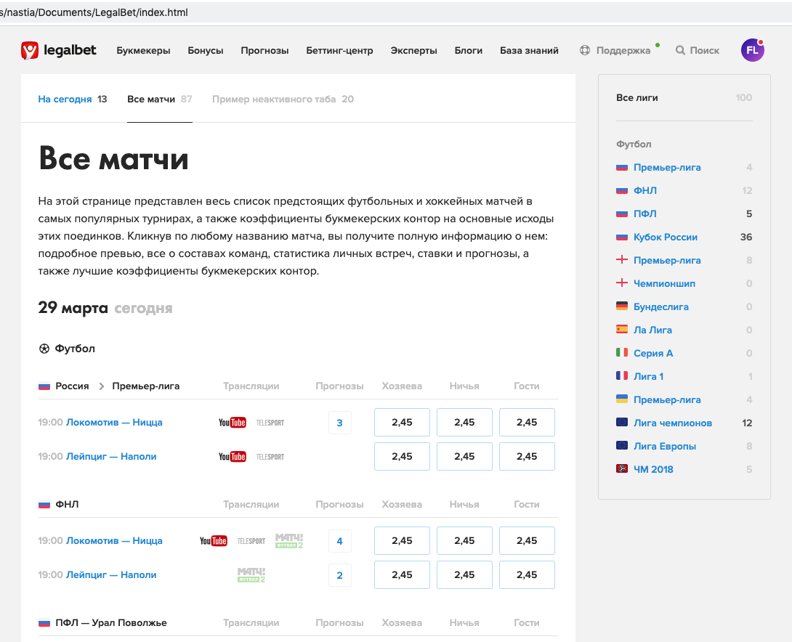

<h1>Тестовое задание для LegalBet</h1>

Для сборки выполнить команды:

npm install

gulp

Далее в браузере на локальном хосте запустится собранный проект

Если неудобно собирать, можно открыть в браузере файл index.html в корне проекта,
на всякий случай оставляю папку dist под гитом - чтобы вы смогли проверить тестовое без сборки

Внешний вид проекта, который должен получиться после сборки:

Десктоп 

Адаптив под iPhone 5SE (320px) 
")